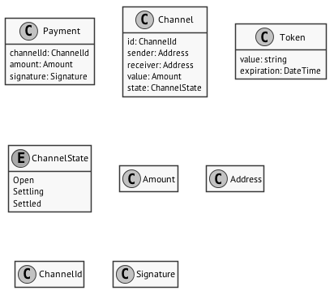

# Library Architecture


Notation:
- a layer uses the one on bottom,
- grayed out box is external to the library,
- mustard blocks belong to [@machinomy/contracts](https://github.com/machinomy/machinomy-contracts) package.

## Entities

Machinomy library user operates in domain entities. `ChannelManager`, `Transport` layers perform
serialisation of that to a structure more suitable for lower levels, and deserialize that back.



## Components

### Machinomy

Top-Level Interface for the library user.

- constructor(initialChannelValueStrategy, channelDepletionStrategy)
  - TBD initialChannelValueStrategy and channelDepletionStrategy are holes to be filled
  - instantiate channelManager(initialChannelValueStrategy, channelDepletionStrategy)
- buy(sender, receiver, hubHttpAddress, amount, meta, eventEmitter): (token, channelId)
  - channelId = channelManager.requireOpenChannel(sender, receiver, amount)
  - payment = channelManager.nextPayment(channelId, amount)
  - token = client.doPayment(hubHttpAddress, payment) // or some error
  - return (token, channelId)
- channels
  - Read all the channels from Storage
  - Set updated state for a channel from Blockchain, for all the channels
  - Return the list of the channels as `Channel` objects
- closeChannel(channelId)
  - channelManager.closeChannel(channelId)

### ChannelManager

Manages the state, both off-chain and on-chain.

- closeChannel
  - eventEmitter.emit('startClosing')
  - // push tx to the blockchain
  - eventEmitter.emit('channelIsClosed')
- nextPayment(channelId, amount)
  - // See if spentAmount ≤ channelValue
  - spentAmount = channel.spenAmount + amount
    - // Tracks nonces
    - **// TBD Must respect concurrency HOLE - FIGURE OUT THE MECHANISM IN PLACE**
    - **// Serialize calls somehow**
- channels
- channelById
- requireOpenChannel(sender, receiver, channelValue)
  - // Figure out if that is called sequentially: concurrency issue
  - if not channel is open between (sender, receiver) = ChannelManager.channelBySenderReceiver
    - openChannel(sender, receiver, eventEmitter)
  - channelBySenderReceiver // Query Off-Chain State : Promise(PaymentChannelJSON|null)
    - // Returns a channelId for sender-receiver pair
    - // No access to the database => Not a big deal => That means a payment can not be done at all.
    - // Query the channels storage abstraction
    - storage.channels.find(query = {}) // in pseudo-code

### Storage


### Transport

Namespace container. HTTP Client there is responsible for sending a payment to a hub,
and receiving a token. WebSocket Client is planned for the future.

HttpClient:
- sendPayment(payment)
  - // Format request to the hub
  - // Send to the hub
  - // Parse the response
  - // Response back with the token
- verifyToken(token)
  - // get token, send that to the hub
  - // parse the result, return boolean

`sendPayment` initiates a serialisation flow below:
```
AcceptPaymentRequest [payment → (req POST /accept) → payment] → (...) → [token → (res /accept) → token] AcceptPaymentResponse
``` 

namespace AcceptPaymentRequest:
- toRequest(payment, gateway)
- fromRequest(request)

namespace AcceptPaymentResponse:
- toResponse(token)
- fromResponse(token)

`verifyToken` initiates a serialisation flow below:
```
VerifyTokenRequest [token → (req GET /verify)→ token] → (...) → [bool → (res /verify) → bool] VerifyTokenResponse
```

namespace VerifyTokenRequest:
- toRequest(token, gateway)
- fromRequest(request)

namespace VerifyTokenResponse:
- toResponse(token)
- fromResponse(token) 

Reason for having these \*Request and \*Response objects is to have (de)serialisation in one place,
and reuse it on hub side.  

## How to get there

Goal of the refactoring is to harden the library for a production use. That involves minimising a scope for every component there is,
writing extensive tests, and independent review of the code, and architecture.

As the refactoring is done, a pain point is left intact related to waiting for blockchain transactions. For that,
proposed approach is to add additional `EventEmitter` parameter to long-waiting methods. That `EventEmitter` is managed by
the library user. The library emits an event before and after long method is called.

TBD Set of events, and when these are emitted.
